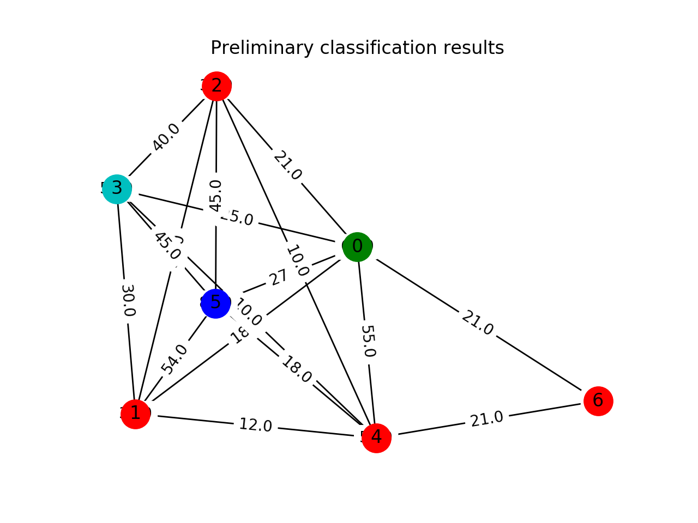
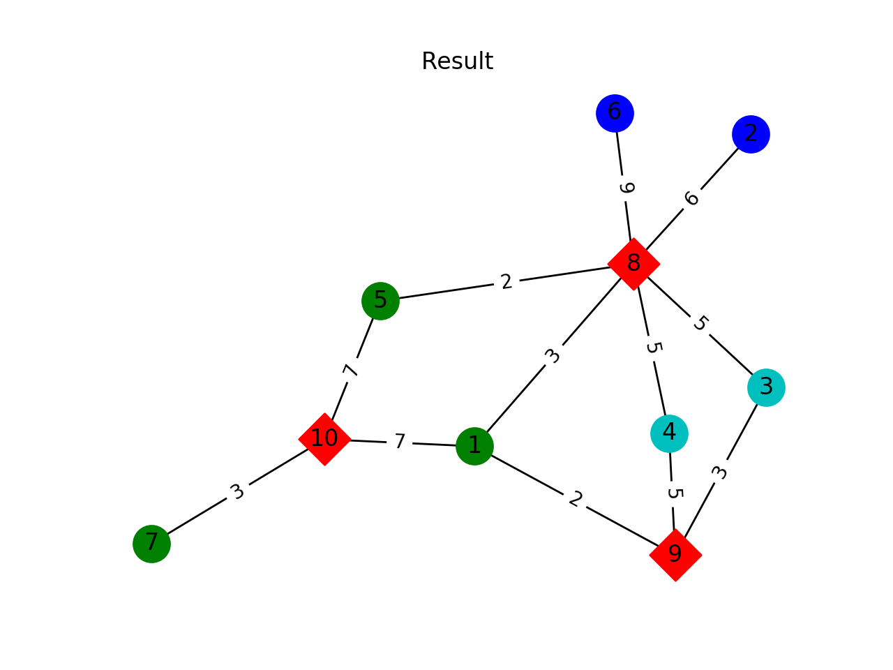

# HCD_sgl
基于单条原路径实现的异质信息网络社团划分算法，参考论文《异质信息网络中基于元路径的社团发现算法研究》

## 文件格式
### edges
|  起点   |  终点  | 权重 |
|  ----  | ----  | ---- |
|   1    |   8   |  10  |

### nodes
| 节点编号 | 类型编号 | 类型标记 |
|  ----  |  ----   |  ----  |
|   1    |    1    | A(作者) |
|   8    |    2    | C(会议) |

## 结果展示
在图表中，以不同形状来表示不同类型的节点，以不同颜色来展示所属社团（C类节点不参与社团划分，在最终划分结果中默认为红色）。  

初步划分结果：

最终划分结果：

## 参考文献
[1]郑玉艳,王明省,石川,王锐.异质信息网络中基于元路径的社团发现算法研究[J].中文信息学报,2018,32(09):132-142.

